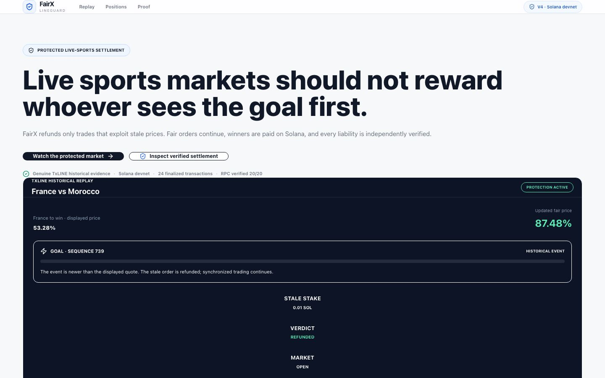
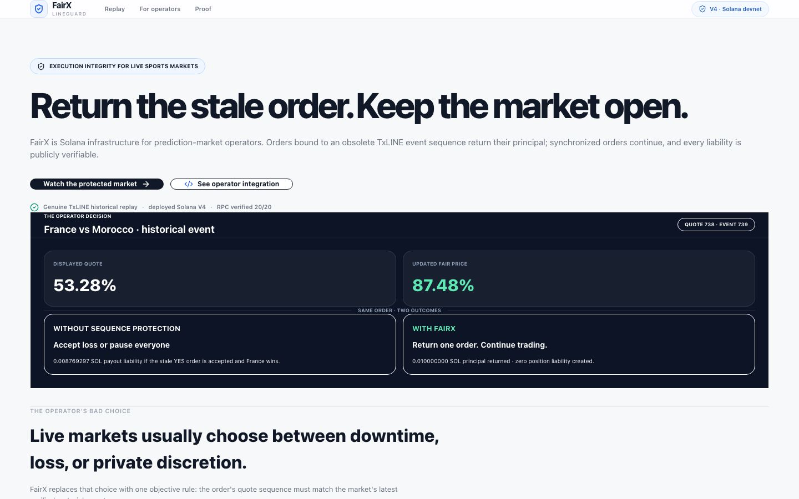
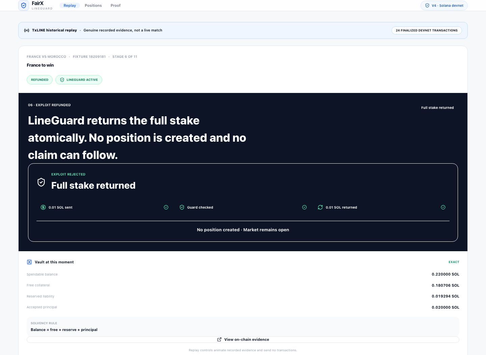
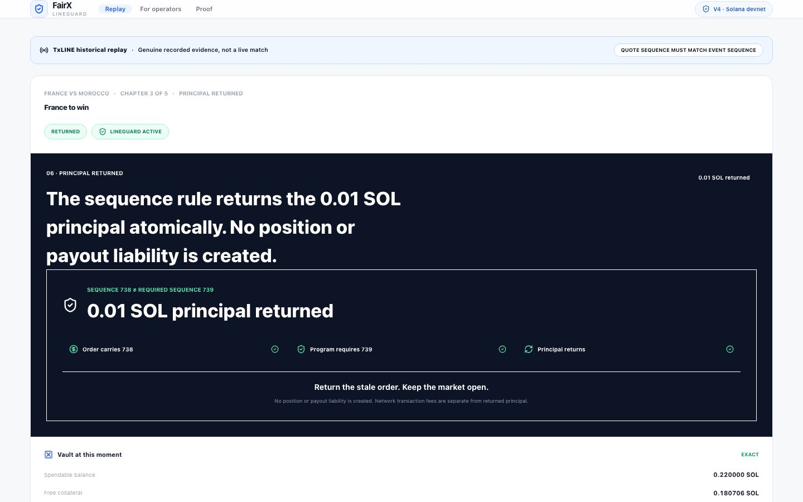
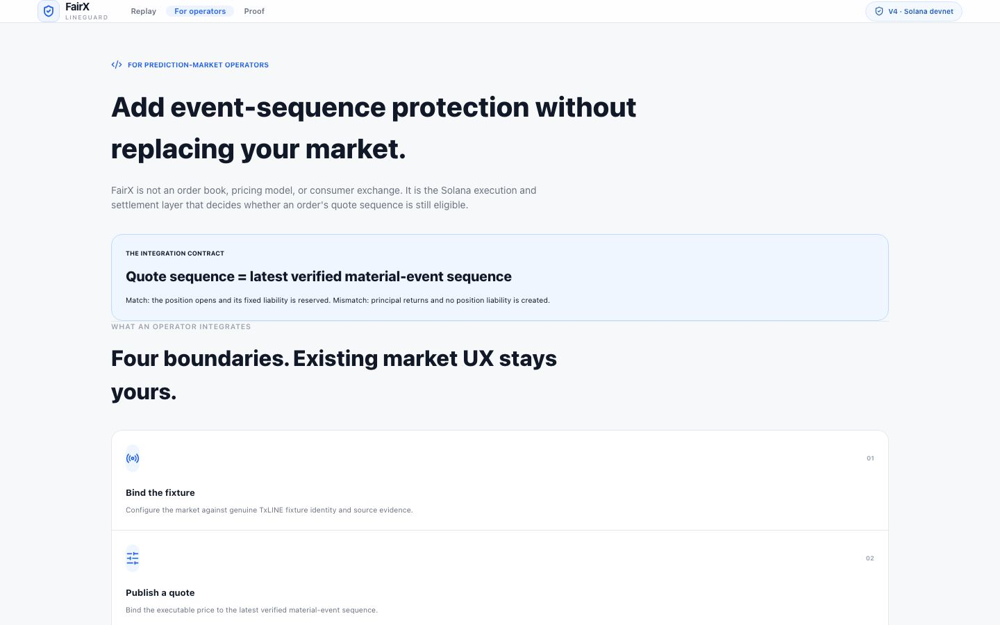
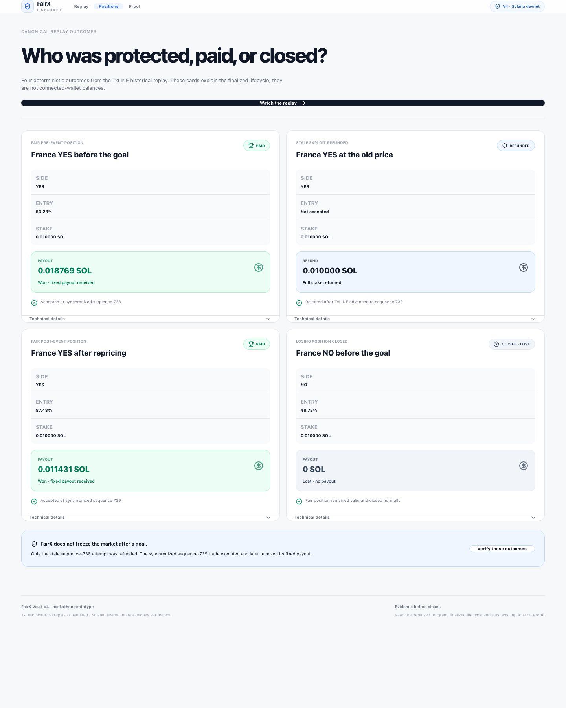
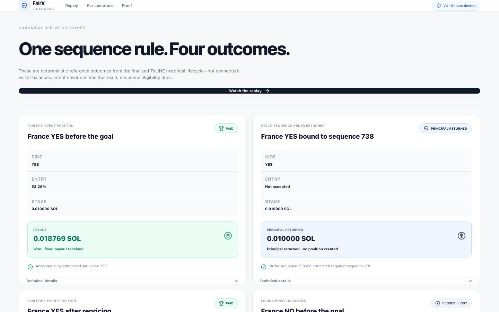
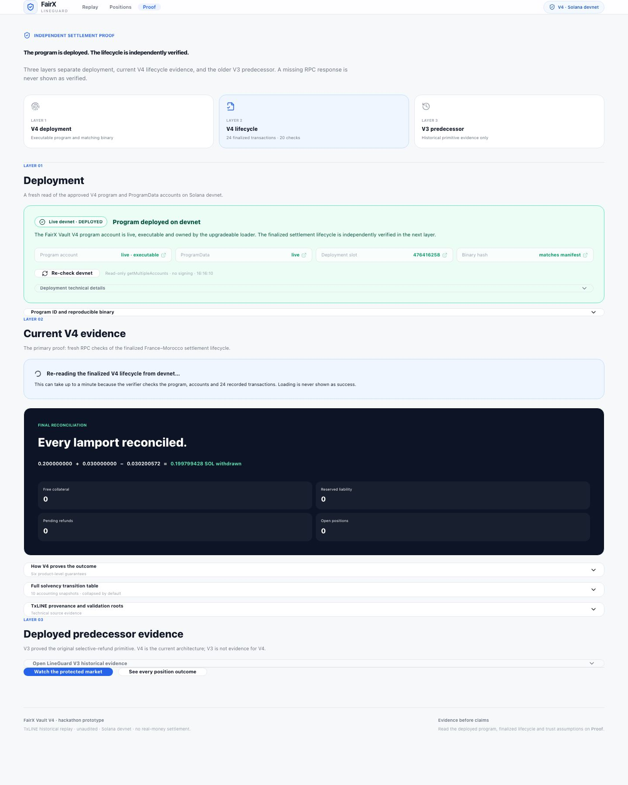
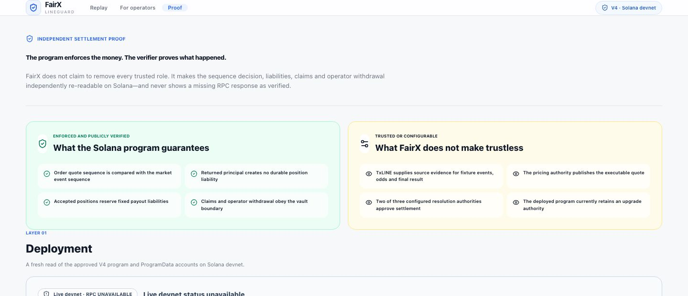

# FairX final product review

This review treats FairX as a judge-facing product, not as a protocol audit. The canonical evidence, deployed program, and settlement lifecycle are unchanged.

## Homepage

### Before

**Good:** the protection mechanism was visible, the TxLINE relationship was real, and the page contained substantial evidence.

**Bad:** FairX read like a small consumer prediction market competing with Polymarket. The strongest value—an operator avoiding obsolete-information liability without pausing the market—was buried. The page asked a judge to infer the customer, integration boundary, and economic impact.

**Needed:** one buyer, one costly decision, one rule, and one measurable outcome above the fold.

### After

- Positions FairX as execution and settlement infrastructure for prediction-market operators.
- Leads with the product outcome: “Return the stale order. Keep the market open.”
- Shows the canonical operator decision and exact 0.008769297 SOL counterfactual liability.
- Explains the five enforceable moments before presenting architecture.
- States why Solana matters and what remains trusted.

**Remaining risk:** the canonical economics prove the mechanism on one small recorded order, not aggregate commercial savings or market demand. That is intentionally disclosed rather than disguised as traction.

## Replay

### Before

**Good:** deterministic historical evidence, exact balances, and the full lifecycle were present.

**Bad:** eleven equally weighted scenes made the demo feel like an implementation walkthrough. “Bot” and intent-oriented language invited arguments about trader morality rather than the objective execution rule. The principal-return climax competed with controls, accounting, and internal state.

### After

- Five judge-facing chapters group the exact eleven internal lifecycle moments.
- The top rule is explicit: quote sequence must match event sequence.
- Chapter three turns the mismatch into one legible comparison: order 738, program requires 739, principal returns.
- It states that no position or payout liability is created and that network fees are separate.
- Chapters four and five prove the differentiator: trading continues, then settlement reconciles.

**Remaining risk:** playback is a deterministic historical presentation, not a live order submission. The interface says this twice and links to the separate finalized on-chain proof.

## Operator integration

### Before

The previous `/integrate` route redirected away. A judge could understand the mechanism but not who installs it, what FairX replaces, or what remains in the operator's stack.

### After

- Defines FairX as neither an order book, pricing model, nor consumer exchange.
- Reduces integration to four boundaries: fixture, quote, order, resolve/reconcile.
- Separates operator, TxLINE, FairX, and public-RPC responsibilities.
- Makes the centralized alternative explicit: the rule can be copied privately, but the independent evidence cannot.

**Remaining risk:** there is no production SDK, pilot operator, SLA, compliance layer, or mainnet deployment. These are commercialization gaps, not hidden hackathon claims.

## Position outcomes

### Before

**Good:** all canonical outcomes and payouts were visible.

**Bad:** the stale participant was characterized by identity/intent, and “refund” could be misread as fee reimbursement or a discretionary support action.

### After

- “One sequence rule. Four outcomes.”
- “Stale-sequence order returned” replaces identity-based framing.
- The result is precise: principal returned, no position created.
- Fair pre-event, synchronized post-event, and losing positions remain visibly valid.

## Proof

### Before

**Good:** unusually deep deployment, proof, lifecycle, and solvency evidence.

**Bad:** evidence density came before the claim boundary. A judge could wrongly conclude either that everything was trustless or that FairX was hiding authority assumptions inside technical accordions.

### After

- Opens with the distinction between program enforcement and verifier evidence.
- Places the trust boundary before deployment details.
- Names pricing authority, TxLINE source evidence, 2-of-3 resolution, and upgrade authority.
- Keeps V4 as current evidence and V3 explicitly secondary.

**Remaining risk:** an unaudited, upgradeable devnet program is not production settlement infrastructure. The page says so; freezing/multisig, audit, key management, monitoring, and mainnet operations remain future work.

## Final judge test

A judge should now be able to repeat all five statements after one pass:

1. FairX is for live prediction-market operators.
2. The order's quote sequence must match the latest material-event sequence.
3. A mismatch returns principal without creating a position liability.
4. Synchronized orders continue; the entire market does not pause.
5. TxLINE supplies source evidence, while Solana makes execution, liabilities, and settlement independently re-readable.
